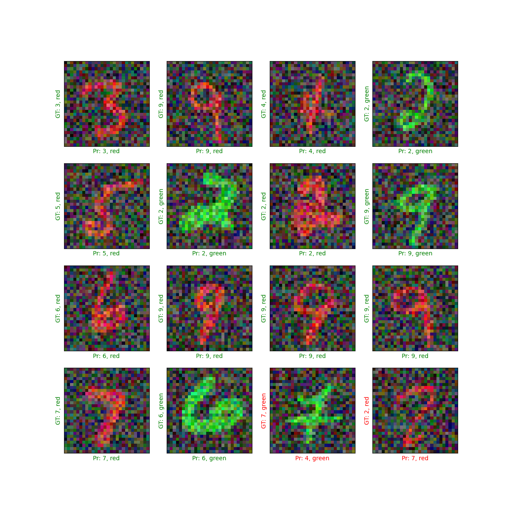

# Multi-Task Multi-Output Model with Keras

This repository contains a project that demonstrates the creation, training, and evaluation of a multi-task, multi-output neural network model using Keras. The model is designed to predict both the digit number and its color in an image. The Keras functional API is utilized to create a multi-output architecture, where the model learns to predict two different labels based on the same input example.

## Project Overview

In this project, we build a multi-output neural network using the Keras functional API. The model takes an image as input and produces two separate outputs: the predicted digit number and the predicted color. The model architecture includes shared layers between the two outputs, and it also incorporates a ResNet-style skip connection to enhance its learning capabilities.

## Libraries Used

- TensorFlow
- Keras
- Matplotlib
- NumPy

## Getting Started

1. Clone this repository to your local machine.
